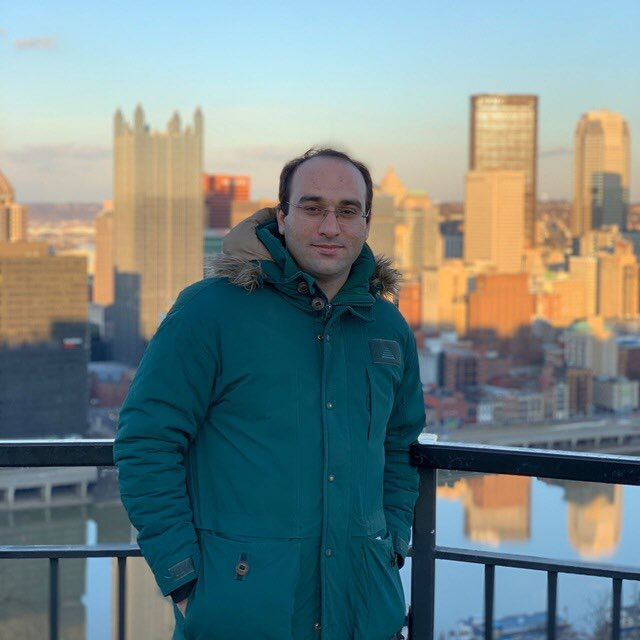

I'm Postdoctoral Research Fellow at the [Beckman Institute](https://beckman.illinois.edu/) working with the Science and Technology Center for [Quantitative Cell Biology](https://qcb.illinois.edu/). I got my PhD from the [Statistics Department](https://stat.illinois.edu/) under supervision of [Ruoqing Zhu](https://sites.google.com/site/teazrq/home?authuser=0), [Douglas G Simpson](https://stat.illinois.edu/directory/profile/dgs) and [Qi Zheng](https://louisville.edu/sphis/directory/qi-zheng-phd).
    
Before joining UIUC, I was a PhD student in the [Economics Department](https://econ.la.psu.edu) at the Pennsylvania State University and I did my Master's in Economics in the [Economics Department](https://dse.unibo.it/en/index.html) at the University of Bologna, Italy.

                                   

